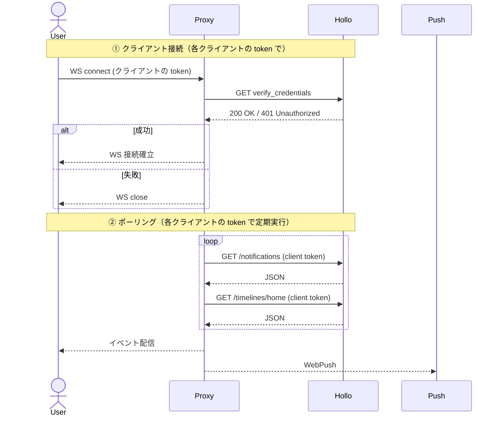

# Hollo Stream Proxy

[Hollo](https://github.com/fedify-dev/hollo) 用の Streaming / WebSocket & WebPush を代替するProxy実装

Push 通知および Streaming 非対応の Hollo で、擬似リアルタイム通知とTL更新を実現します。
また Instance API の補完（`urls.streaming_api` 注入）と Filters エンドポイントも提供します。

## 機能

| 機能 | エンドポイント | 説明 |
|---|---|---|
| WebSocket Streaming | `GET /api/v1/streaming` | Mastodon 互換ストリーミング API。`access_token` 認証 |
| WebPush Subscription | `/api/v1/push/subscription` | Mastodon 互換プッシュ通知購読 API（CRUD） |
| Instance API | `/api/v1/instance`, `/api/v2/instance` | Hollo のインスタンス情報をプロキシし `urls.streaming_api` を注入 |
| Filters | `/api/v1/filters`, `/api/v2/filters` | 空配列 `[]` を返す（Hollo 非対応のため） |

- 認証: 各クライアントが自身の `access_token` を使用
- 通知取得: 各クライアントのトークンで Hollo REST API をポーリング
- プッシュ通知: `web-push` ライブラリで VAPID 署名 + 送信
- 購読情報: PVC 上の JSON ファイルで永続化管理

## 環境変数

| 変数 | 必須 | デフォルト | 説明 |
|---|---|---|---|
| `HOLLO_URL` | **必須** | — | Hollo の公開 URL |
| `HOLLO_INTERNAL_URL` | | `HOLLO_URL` | Hollo の内部 URL（K8s Service DNS 等） |
| `PORT` | | `3001` | リッスンポート |
| `POLL_INTERVAL` | | `3000` | ポーリング間隔（ミリ秒） |
| `DATA_DIR` | | `/data` | 購読データの保存先 |
| `VAPID_PUBLIC_KEY` | | — | WebPush VAPID 公開鍵 |
| `VAPID_PRIVATE_KEY` | | — | WebPush VAPID 秘密鍵（未設定時はプッシュ配信無効） |
| `VAPID_SUBJECT` | | `https://example.com` | VAPID subject |

## ヘルスチェック

`GET /health` — `200 OK`

## コンテナイメージ

```
ghcr.io/ntsklab/hollo-stream-proxy:0.12.0
```

## デプロイ

### 1. VAPID 鍵生成

```bash
node gen-vapid-keys.mjs
```

### 2. マニフェスト準備

```bash
cp hollo-stream-proxy.yaml.sample hollo-stream-proxy.yaml
```

`<NAMESPACE>` を置換し、`HOLLO_URL`、VAPID 鍵を設定。

### 3. デプロイ

```bash
kubectl apply -f hollo-stream-proxy.yaml
```

### 4. HAProxy 設定

`haproxy.conf.sample` を参照し、instance / filters / streaming / push を本プロキシに振り分け。

## API リファレンス

### WebSocket Streaming

```
GET /api/v1/streaming?access_token=xxx&stream=user
```

| パラメータ | 説明 |
|---|---|
| `access_token` | アクセストークン（**必須**） |
| `stream` | ストリーム種別（`user`） |

### WebPush Subscription

```
POST   /api/v1/push/subscription  — 購読登録
GET    /api/v1/push/subscription  — 購読情報取得
PUT    /api/v1/push/subscription  — アラート設定更新
DELETE /api/v1/push/subscription  — 購読解除
```

`Authorization: Bearer <access_token>` 必須。

購読時の `data.alerts` で以下の通知種別を制御できます。未指定の場合は `true`（有効）として扱われます。

- `mention`, `status`, `reblog`, `favourite`, `follow`, `follow_request`, `poll`, `update`
- `admin_sign_up`, `admin_report`, `severed_relationships`
- `reaction`（Hollo の `emoji_reaction` 用）

Hollo の `emoji_reaction` 通知は `reaction` または `favourite` が有効な場合に配信されます。
配信ペイロードは `{ access_token, notification_id, notification_type, icon, title, body, notification }` の JSON 形式です。

### Instance API

```
GET /api/v1/instance  — Mastodon v1 Instance API
GET /api/v2/instance  — Mastodon v2 Instance API
```

### Filters

```
GET /api/v1/filters  — 空配列
GET /api/v2/filters  — 空配列
```

## アーキテクチャ

各クライアントは自身の `access_token` を使用して接続し、Proxy はそのトークンで Hollo API をポーリングします。複数の Hollo アカウントを持つユーザーも、各アカウントのトークンで個別にポーリングされるため、すべて利用可能です。



## フロントエンド設定

### HAProxy

`haproxy.conf.sample` を参照。要点:

- Instance API / Filters / Streaming / Push を本プロキシに振り分け
- WebSocket 用バックエンドは `timeout tunnel 24h` を設定
- ヘルスチェックは `/health`

### Nginx（代替）

```nginx
location /api/v1/instance { proxy_pass http://hollo-stream-proxy.NAMESPACE:3001; }
location /api/v2/instance { proxy_pass http://hollo-stream-proxy.NAMESPACE:3001; }
location /api/v1/filters  { proxy_pass http://hollo-stream-proxy.NAMESPACE:3001; }

location /api/v1/streaming {
    proxy_pass http://hollo-stream-proxy.NAMESPACE:3001;
    proxy_set_header Upgrade $http_upgrade;
    proxy_set_header Connection "upgrade";
    proxy_read_timeout 86400s;
}

location /api/v1/push/subscription {
    proxy_pass http://hollo-stream-proxy.NAMESPACE:3001;
}
```

## ファイル構成

```
.
├── index.js                        # メインアプリケーション
├── package.json
├── Dockerfile
├── gen-vapid-keys.mjs              # VAPID 鍵生成
├── hollo-stream-proxy.yaml.sample  # K8s マニフェスト
├── haproxy.conf.sample             # HAProxy 設定
└── README.md
```
